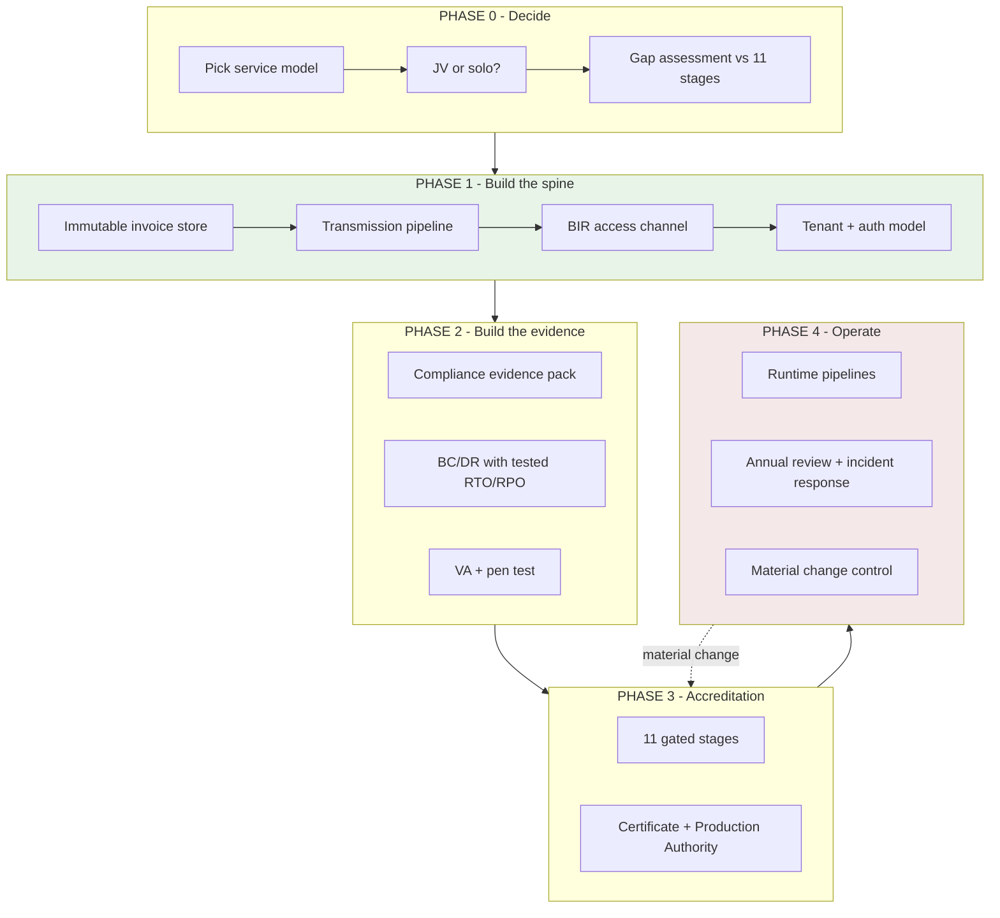
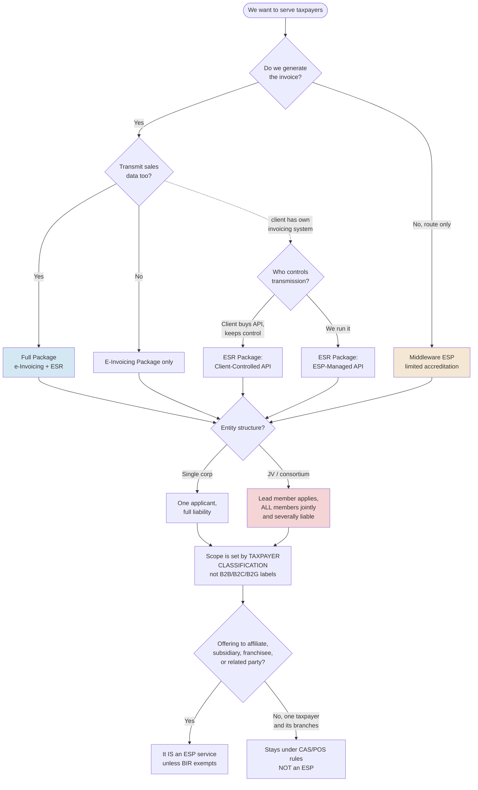
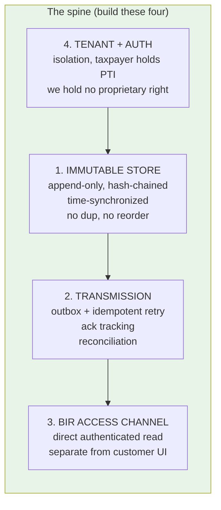
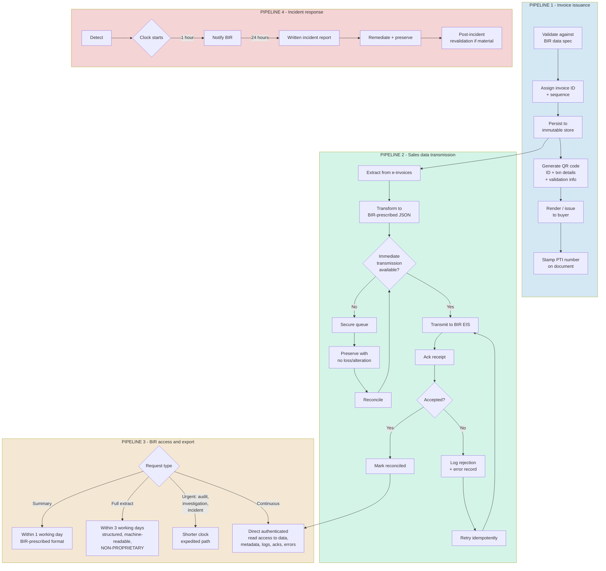
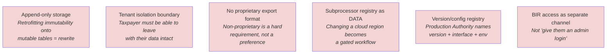
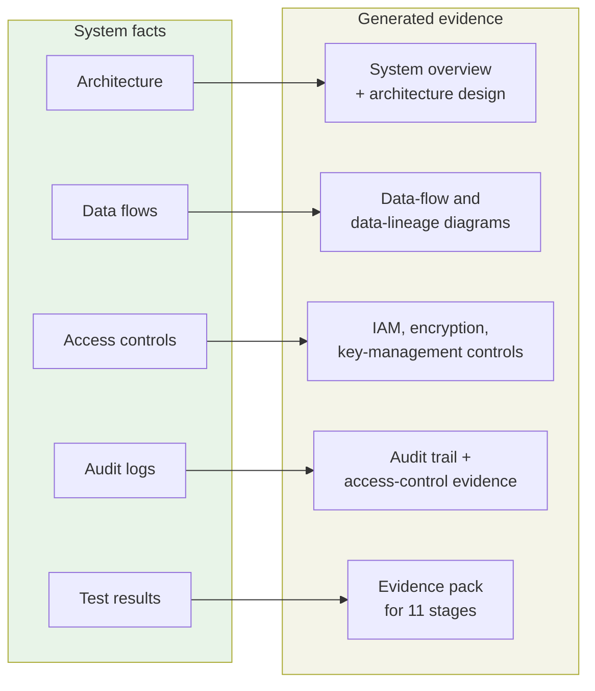
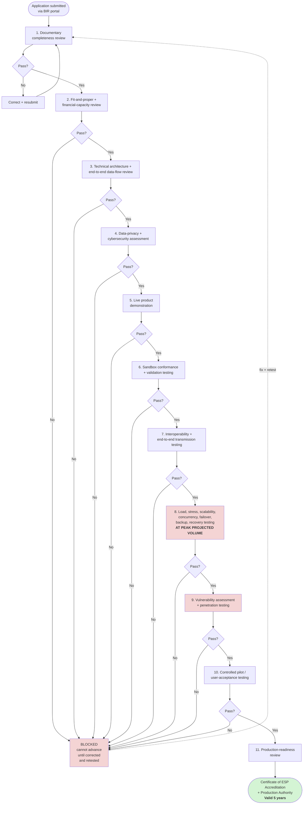
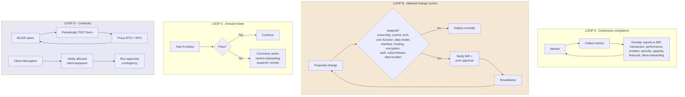
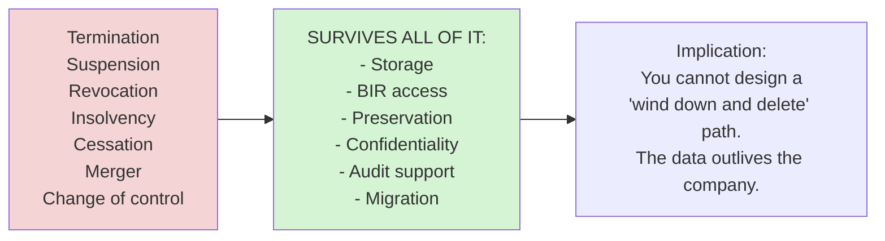

# BIR ESP: Approach and Pipelines

Companion to `bir-esp-tor-requirements.md`. Source: draft RMC on ESP accreditation.

---

## 0. The mental model

There are **two clocks** running and they are not the same clock.

**Clock 1, the accreditation clock.** You are a vendor trying to earn the right
to operate. 11 gated stages, 19 application items, then 5 years of standing
obligations. This is a project with a start and an end.

**Clock 2, the runtime clock.** Once live, you are a regulated utility moving
taxpayer money-data. Every invoice, every transmission, every incident runs on
BIR-mandated timers that never stop.

Most teams conflate these. They build for clock 1 (pass the demo), then discover
clock 2 is the actual business. Design for clock 2; treat clock 1 as evidence
collection over the system you already built.

---

## 1. Top-level map

**Read it as:** Phase 1 is the only phase where you write product code. Phase 2
generates artifacts *from* that code. Phase 3 proves it. Phase 4 is the actual
business, and it can send you back to Phase 3 at any time.

---

## 2. Phase 0: the decision tree

Get this wrong and you rebuild later.

**The trap to avoid:** an internal system you built for one client is not an ESP
service. The moment you sell it to that client's *sister company*, it is.

---

## 3. Phase 1: the core system

Four building blocks. Everything else is a view over these.

### 3a. The runtime data pipelines

This is the actual money path. Every arrow is a failure point.

**Why the outbox matters:** subgraph TX exists because "where immediate
transmission is unavailable, the system shall securely queue, preserve,
reconcile, and retransmit the data without loss, alteration, corruption, or
duplication." The words *without duplication* are why retries must be
idempotent. An at-least-once queue without a dedupe key fails accreditation.

### 3b. The one-way doors

These are architectural decisions that are expensive to reverse. Decide them
before writing code, not during the pen test.

---

## 4. Phase 2: the evidence pipelines

You do not write these documents. You generate them from the system.

### The 19 application items, grouped by how you produce them

| Group | Items | How produced |
|---|---|---|
| **Corporate** | SEC reg, primary purpose, permits, sworn CEO certification, beneficial-owner disclosure, insurance/bond | Legal + finance, manual |
| **Architecture** | System description, data flow, data lineage, hosting/cloud/data-location, API docs, third-party dependencies | **From code + infra** |
| **Security** | Encryption/auth protocols, IAM + key management, VA/pen-test report, incident-response plan | **From code + pen test** |
| **Continuity** | BC/DR plans with **tested** RTO/RPO, backup/recovery architecture | **From tested drills** |
| **Governance** | Subcontractor register, SLA framework, exit/migration/portability plan, sample invoices + formats | **From system + contract** |

Note the bolded ones. Six of the eleven system-overview sub-items are things you
should be able to regenerate from your own repo and infra config. If you're
writing them by hand in Word, you'll be re-writing them at every material change
for the next five years.

---

## 5. Phase 3: the accreditation pipeline

**Budget note:** stages 8 and 9 are the expensive third-party gates, and they
land *before* the pilot. Book your load-test and pen-test vendors early. Both
are recurring costs: annual review plus revalidation after any material change.

**Third-party certs are supporting evidence only.** A SOC 2 report never
replaces BIR testing.

---

## 6. Phase 4: the operating loops

Accreditation is not the finish line. Four loops run forever.

**Loop B is the one teams forget.** Your normal CI/CD deploy pipeline can trip
it. If a release changes the interface, the encryption method, or the hosting
region, you need BIR approval *before* shipping. Put a gate in the pipeline, not
in someone's memory.

---

## 7. What survives death (and why it changes the design)

Compounding on that: **storage continues until the BIR formally certifies
migration is complete AND authorizes discontinuance.** There is no
self-determined retention end date. Your retention policy cannot be a config
value you set.

And: you may not withhold, disable, degrade, or condition access because of
unpaid fees or a contract dispute. The obvious implication is that a
non-paying tenant does not get cut off from their own data.

---

## 8. Suggested build order

```mermaid
gantt
    title Sequencing (relative, not calendar-fixed)
    dateFormat X
    axisFormat %s

    section Phase 0
    Model + entity decision           :p0, 0, 2

    section Phase 1 (product)
    Immutable store + schema          :p1a, 2, 6
    Transmission + outbox + retry     :p1b, after p1a, 6
    BIR access channel + export       :p1c, after p1b, 5
    Tenant isolation + auth           :p1d, 2, 5

    section Phase 2 (evidence)
    Arch + lineage docs (generated)   :p2a, after p1c, 3
    BC/DR build + drill               :p2b, after p1c, 4
    VA + pen test vendor              :p2c, after p2a, 4

    section Phase 3
    Portal application                :p3a, after p2c, 2
    Stages 1-7                        :p3b, after p3a, 6
    Stages 8-9 (peak load + pen)      :p3c, after p3b, 4
    Stages 10-11 (pilot + readiness)  :p3d, after p3c, 4
```

The critical insight: **the evidence phase is not a documentation phase.** BC/DR
drills and pen tests take real wall-clock time and can force code changes. Start
the vendors during Phase 1, not after Phase 1 ends.

---

## 9. Ten requirements that become code

Filtered from the requirements doc down to things that show up in a repo.

| # | Requirement | Shows up as |
|---|---|---|
| 1 | Immutable, time-synchronized, sequential, non-duplicated | Append-only table + hash chain + monotonic sequence per tenant |
| 2 | Queue, preserve, reconcile, retransmit without duplication | Outbox table + idempotency key + ack reconciliation job |
| 3 | QR code per invoice with ID + txn details + validation | QR generation service, spec-driven, versioned |
| 4 | Summary 1 day / extract 3 days, non-proprietary | Export service + scheduler + object storage handoff |
| 5 | Continuous direct BIR access to data, logs, acks, errors | Read-only BIR-scoped API, separate from tenant UI |
| 6 | Client holds PTI, we hold no proprietary right | Authority records owned by tenant, transferable |
| 7 | Subprocessor disclosure before change | Registry table + approval workflow + change gate |
| 8 | 1-hour incident notification | Detection + alerting + notification service with timers |
| 9 | Production Authority names version/interface/env | Release registry + deploy gate checking against approved tuple |
| 10 | Export/migrate to another ESP without unreasonable cost | Full-fidelity export format + documented import path |

Each of these is a schema decision, not a feature ticket. Fix them at the
schema level and the features fall out.

---

## 10. Open questions before committing

1. **TOR Annex "A"** is referenced but not in the source PDF. It likely contains
   the actual technical and data specifications. Get it before finalizing schema.
2. **BIR EIS API spec, JSON schema, QR technical spec** are all "separately
   issued" and unread. These define Pipeline 2 precisely.
3. **Numeric thresholds** (uptime %, latency, RTO/RPO targets, minimum volumes by
   tier) are left to BIR prescription and are not in this document. Stages 8 and
   9 cannot be scoped without them.
4. **RMC number and effectivity** are blank in this draft. Effectivity is stated
   as immediate once issued.
5. **Which service model** you're targeting. The build differs substantially
   between Middleware ESP (thin) and Full Package (everything).
